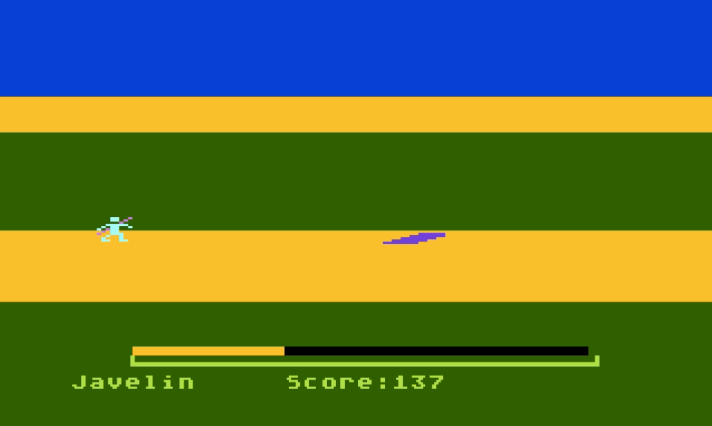

# Atari Olympics

> A seven-event Olympic athletics game written entirely in **ATARI BASIC**, created in 1984 by **Mark Longo**.

---

## Overview

Atari Olympics is a classic multi-event sports game for the **Atari 8-bit family** (400/800/XL/XE). Programmed from scratch in ATARI BASIC with hand-crafted 6502 machine-language routines for smooth **Player-Missile Graphics** (hardware sprites), it puts you through seven Olympic field-and-track events in a single joystick-waggling session. Your cumulative score carries over event to event, so consistency counts.

Written in 1984, well before sports compilations became a mainstream genre, this is a complete single-file BASIC program that squeezes animated sprites, multi-channel sound, collision detection, and a persistent scoreboard into fewer than 200 lines of code.

---

## Events

| # | Event | Scoring |
|---|-------|---------|
| 1 | 100m Sprint | Time-based bonus |
| 2 | Javelin | Distance in metres |
| 3 | Shot Put | Distance in metres |
| 4 | Long Jump | Distance in metres |
| 5 | 1000m Run | Time-based bonus |
| 6 | Discus | Distance in metres |
| 7 | High Jump | Height cleared (starts at 2 m) |

A "Scratch" (false start) or "Missed" (bar knock in high jump) costs an attempt. Three failed attempts in a throwing/jumping event moves you to the next one.

---

## Controls

All events use a **single joystick** (port 1).

| Action | Input |
|--------|-------|
| Build speed / power | Rapidly alternate joystick **Left → Right → Left …** |
| Release (throwing events) | Press the **fire button** at peak power |
| Restart after Game Over | Press **START** on the console |

The on-screen power bar shows your current speed. Let it drop and your athlete slows down or fouls.

---

## How to Run

### Using an Emulator (recommended)

1. **[Atari800](https://atari800.github.io/)** (cross-platform).
2. Configure the emulator with Atari XL/XE OS ROM images.
3. Configure emulator to use Harddisk
4. in BASIC type LOAD "H1:AO.BAS"

### On Real Hardware

Transfer `AtariOlympics.bas` to a disk image (`.atr`) using a tool such as **[dir2atr](http://www.horus.com/~hias/atari/)**, copy to a real disk or SIO2PC/SIO2SD device, then `LOAD "D:AO.BAS"` and `RUN`.

---

## Files

| File | Description |
|------|-------------|
| `ao.bas` | Binary ATARI BASIC file — load directly into any Atari 8-bit or emulator |
| `ao.txt` | ASCII plain-text BASIC listing — human-readable source |
| `ao.lst` | Raw tokenised listing export |

---

## Technical Notes

- **Language:** ATARI BASIC (built-in ROM BASIC on all Atari 8-bit computers)
- **Graphics mode:** GRAPHICS 5 (80×48, 4 colours)
- **Sprites:** Player-Missile Graphics — three hardware players animate the athlete and thrown implement
- **Sound:** Four-channel POKEY sound chip used for running cadence and throw effects
- **Machine language:** A compact 6502 routine (lines 2000–2100) handles Player-Missile DMA setup and sprite blitting, called via `USR()`
- **Year:** 1984

---

## Credits

**Mark Longo** — original design, programming, and graphics (1984)

---

## License

This project is shared for historical preservation and educational purposes. All original authorship rights belong to Mark Longo.
